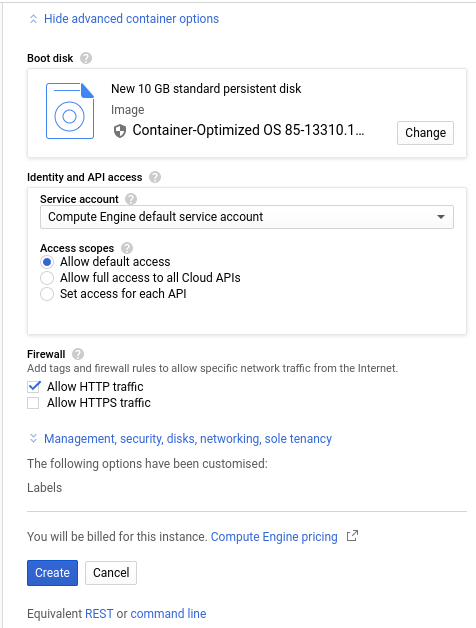
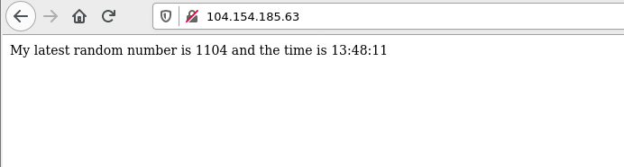

# 5 Minute Introduction to Deploying Web Servers on the Cloud using Docker

WARNING: These notes were written for students of the AIMLAC Centre for Doctoral Training, do not treat them as being sufficient for securely deploying a production ready system. 

## Pre-Requisties

* A [https://hub.docker.com](Dockerhub) account
* A [https://cloud.google.com/](Google Cloud) or [https://portal.azure.com/](Azure) account with some credit. Get the [https://education.github.com/pack](Github Student Pack) for some free Azure credit.
* A local install of Docker and git.

## Build the Docker container

If you haven't already, create an account on Docker Hub. On your command line login to docker hub with the `docker login` command.

Clone this repository, build the docker container in it and push it to your Docker Hub. The image contains a basic Debian container running the Nginx web server and a simple shell script which writes the time and a random number to index.html.

~~~
git clone https://github.com/colinsauze/5minute-cloud-docker-intro
docker build -t username/5min-cloud-docker .  #replace username with your dockerhub username
docker push username/5min-cloud-docker
~~~

## Test Locally

Run the command:

`docker run --name webserver -d -p 8080:80 username/5min-cloud-docker`

This will launch the container with a web server running and listening on port 80 in the container. The `-p 8080:80` option maps this to port 8080 on the host system.

Visit [http://localhost:8080](http://localhost:8080)

### Stop the container

Run: 

`docker stop webserver`

## Deploy on Google Cloud

Google cloud has an option to deploy a container directly but it doesn't allow any network services like web servers running in that container to be accessed from the internet. Instead we will have to create a standard VM and manually run docker on it.

* Go to the [https://console.cloud.google.com/](Google Cloud Console)
* Click on the grill menu in the top left, choose "Compute Engine" and then click "VM Instances". 

* Click on "Create Instance" on the page showing the list of current instances.
* Give your VM a name, as we won't need much processing power choose f1-micro as the Machine type. 

* Click "Change" on the Boot disk and choose "Container Optimized OS"

* Tick "Allow HTTP traffic" at the bottom of the page under Firewall

* Click create
* Once created SSH into the VM by clicking the SSH option in the Connect column of the VM list.

* In the SSH session type: `docker run --name webserver --restart always -d -p 80:80 username/5min-cloud-docker`
This will download the image and start it running. The `--restart always` option means it will restart auomatically when the VM reboots.

* Go back to the VM Instances page in the Google Cloud Console and click on the link to the external IP address (104.154.185.63 in this example) or type this address into a new tab/window of your web browser.

* You should see the same page that was shown in the local test

* Don't forget to delete the instance when you are done with it.

## Deploy on Azure

* Go to https://portal.azure.com/
* Under the "Azure Services" section mouse over "Container Instances" and click on "Create"

* Choose a resource group from the list of available groups, if you don't have one create a new one.
* Give the container a name
* In the image box put the name of your Dockerhub image (without hub.docker.com), e.g. `username/5min-cloud-docker`

* Click on "Change size" and change the amount of memory down to 0.5 GiB if you want to minimise your spending.

* Click Next to go to the Networking page.
* "Include public IP address" should already be set to Yes and port 80 TCP should alreday be allowed, if they aren't then change it so they are.
* If you want an easy to remember name instead of just an IP address put something in the DNS name label box. 

* Click next to go to the Advanced page.

* Don't change anything on this page, click next again to go to the tags page.

* Don't change anything on this page either, click next to go to the review and create page.

* Click on the "Create" button
* The container will now be created, it will take about two minutes to deploy.
* Click on "Go to resource"

* Click on the mouse over to the right of the IP address or FQDN and click the "Copy to Clipboard" link.

* Open a new browser tab and paste in this address to visit the the web page running on the container.

## Get a friendly(ier) name for your server

* If you want a more friendly name and own an internet domain already, create a new "A record" for this IP address using your internet domain registrar's control panel page.
* The Github student pack has free domain registrations with Namecheap and Name.com. 
* [https://no-ip.com](no-ip.com) offers a free "dynamic dns" where you can get a DNS record for <your hostname>.ddns.net instead of using your own domain.

## Things to remember

* Your VM will keep running (and using credit) until you delete it.
* This is running on the public internet. Every web crawler, bot, script kiddie, hacker etc will have access to it.
* The content your serving isn't encrypted in transit. If you want to encrypt it look at using LetsEncrypt, but you'll need a domain name first.

